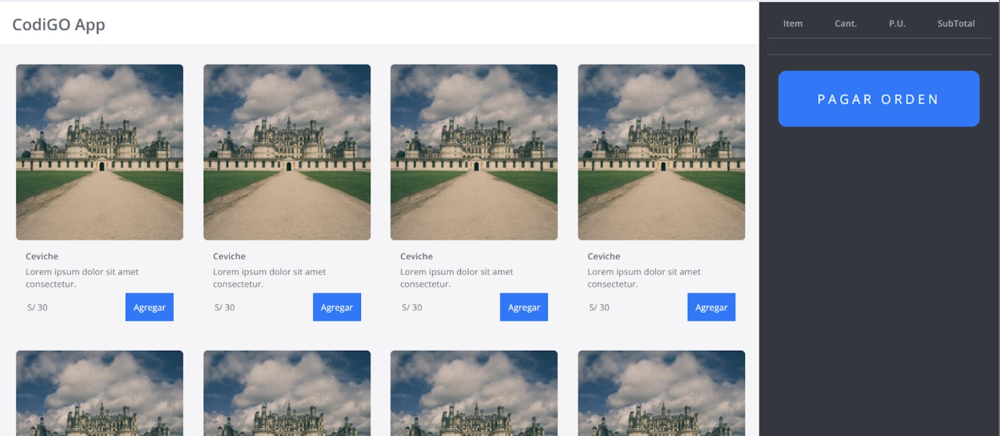

# Proyecto Vanilla JS 🐱‍👤
Hola!, este proyecto/plantilla no requiere Node.js o algún servidor como XAMPP, basta con descargarlo y abrirlo con tu navegador, aunque es muy recomendable que utilices VSCode junto con la extensión LiveServer para facilitar su uso.

## Acerca del proyecto

El proyecto emula un POS, tiene dos zonas definidas, la primera para mostrar los productos y la segunda para mostrar un resumen de los productos seleccionados.

## Acerca del HTML

Incluye comentarios y la estructura para las tarjetas de los productos, las clases de CSS ya se encuentran definidas.

## Acerca del CSS

Tiene estilos generales por etiqueta, un reset sencillo para lidiar con los márgenes, paddings y medidas de los elementos, media queries para el contenido, los nombres de las clases están en español para facilitar la lectura.

## Acerca del JS

Se compone de dos archivos, data.js incluye un arreglo de objetos donde cada objeto representa un platillo, main.js representa el archivo principal donde se realizará el código de manipulación del DOM y otras funciones. Como están separados es importante mantener el atributo `type="module"` en el HTML para que los export/import funcionen correctamente.

## Adicionales
Puedes encontrar el código avanzado en las ramas del proyecto, aunque es preferible que sea una guía y que antes de revisarlo intentes desarrollarlo. Espero te sea útil 🐱‍🐉.